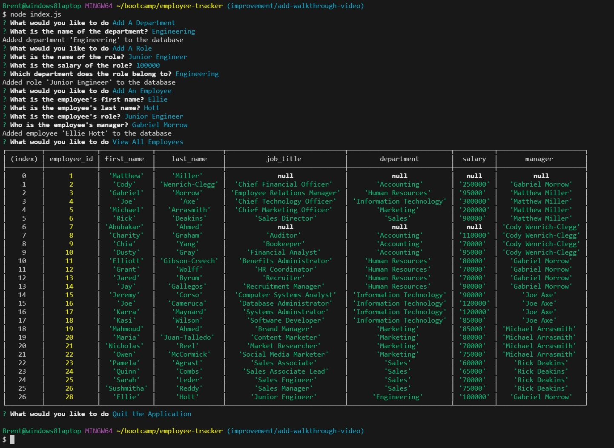

# Employee Tracker

## Description

My motivation for building this project was to gain experience with integrating database functionality into a command-line application.  I built this project so that I could gain practice with querying a local database, and so that I could learn how to use database queries with the inquirer package.  This project solves the problem of a small company needing to keep track of the various departments, job titles (roles), and employees that it has.  The project allows users to create, read, update, and delete departments, roles, and employees.  With this project, I learned how to query a local database using Javascript, and I also learned a bit more about the functionality of the Inquirer package. 

## Table of Contents (Optional)

This README isn't that long, so N/A.

## Installation

First, clone my GitHub repository with the "git clone" command.  Then, you will need to install the dependencies that the application uses, which are inquirer, mysql2, dotenv, and sequelize.  You can install them by running the command "npm install".  You will then need to create a .env file with the following lines in it:

DB_HOST='localhost'

DB_NAME='company_db'

DB_PASSWORD='[your mysql password]'

DB_USER='[your mysql username]'

After this, I recommend running the .sql files in the database folder to create and seed the database.  To do this, first, navigate to the database folder in the program structure.  Then, run the command 
"mysql -u [your mysql username] -p [your mysql password]" and then enter your password.  Once you are inside the mysql shell, run the commands "source schema.sql" and "source seeds.sql" to create and seed the database.

## Usage

Here is a screenshot of some of the application's functionality: 

To start the program, navigate to the correct folder, and run the command "node index.js".  The usage of this program is relatively straightfoward.  The program will ask you what you would like to do.  Navigate between the options using the up and down arrow keys, and hit **Enter** to make a choice.  

The first three options, View All Departments, View All Roles, and View All Employees each print out a single table with one of the three types of data (departments, roles, and employees, respectively).  

For the options to add a department, a role or an employee you will be prompted to enter the name of the department, role, or employee, and then a check will make sure you haven't entered illegal characters.   For the department, that's all you will need to do before the department will be added to the database.  For adding a role, you will need also need to enter the salary of the role (a number with an optional formatting of two decimal places), and the department that the role belongs to.  When adding an employee, in addition to entering the employee's name, you will also need to enter the role the employee has and the employee's manager. 

For the options of updating an employee's role and updating an employee's manager, you will need to select the employee and also select the role or manager that he or she will now have.  It is worth noting that when updating an employee's role, you can't update it to the same role they already have.  Additionally, when updating an employee's manager, you can't give him or her the same manager he or she already has, you can't choose to have the employee be his or her own manager.  However, you can choose to not give the employee a manager (denoted by the option "No Manager").

For the options of viewing employees by manager and viewing employees by department, you will need to select a department or a manager, and then the system will display a table containing all the employees in that department or under that manager, respectively.

For the options of deleting a department, an employee, or a role, you will first need to select a department, an employee, or a role, respectively, and then the system will remove the record in question from the database.

For the option of viewing the total utilized budget of a department, you will need to select a department.  Then, the system will total up the salaries of all the employees who are in roles that belong to that department, and display the result in a table.

The "Quit the Application" option will stop the program.

## Walkthrough Video Explanation

To view the walkthrough for this application please use the following link: [https://drive.google.com/file/d/1p5MMN_se9dCAjzSOv937VBePd5eCGBbS/view](https://drive.google.com/file/d/1p5MMN_se9dCAjzSOv937VBePd5eCGBbS/view).  This video was originally too long, so I trimmed it to get it under two minutes, as stipulated by the post on how to make a walkthrough video here: [https://coding-boot-camp.github.io/full-stack/computer-literacy/video-submission-guide](https://coding-boot-camp.github.io/full-stack/computer-literacy/video-submission-guide).  

To start off, I type "node index.js" to start the program.  I then select the option to View all Departments, and the system displays the table of departments.  I do the same with the options to View All Roles and View All Employees, and the system displays the tables of roles and employees as well. 

 Next, I select the option to Add a Department.  The program asks for the name of the department.  I type "Forensics" and the system responds, saying that the department "Forensics" has been added to the database.  Next, I select the option to View All Departments, and the department Forensics is displayed at the bottom of the table.  

 After this, I select the option to Add a Role.  The system asks what the role should be called.  I type the name "Investigator".  Then, the system asks for a salary.  I type "80000".  Finally, the system asks what department the role should belong to.  I choose the Forensics department that I added previously.  The system responds, saying that the role "Investigator" has been added to the database.  I then select the option to View All Roles, and the Investigator role is displayed at the bottom of the returned table.

 Next, I select the option to Add an Employee.  The system asks for a first name, a last name, a role, and a manager.  I type the values "Josiah", "Morrow", "Accountant", and "Cody Wenrich-Clegg", respectively.  The system responds saying that the employee "Josiah Morrow" has been added to the database.  I select the option to View All Employees, and the employee Josiah Morrow appears at the bottom of the returned table.

 After this comes the option to Update an Employee's Role.  Prompted by the system, I choose to update the employee Matthew Miller to the role of Accountant.  The system provides a confirmation message.  I then choose the option to View All Employees to make sure that the role has been updated appropriately. The employee Matthew Miller is the first employee in the database and thus he appears at the top of the returned table, with the role updated correctly.

 After this I select the option to Update an Employee's Manager.  I choose to update the manager of Cody Wenrich-Clegg to myself (Gabriel Morrow).  I then choose the option to view All Employees.  Cody Wenrich-Clegg appears as record #2 in the returned table, and his manager is now me.

 After this, I choose the option to View Employees by Manager.  The system asks which manager's employees I wish to view, and I choose to view the employees managed by Cody Wenrich-Clegg.  The system provides a table of five employees that he manages.  

 Next, comes the option to View Employees by Department.  The system asks which department's employees I wish to view, and I choose the Accounting department.  The system returns a table of seven employees that are assigned to the accounting department.

 After this, I go through the process of deleting a department, a role, and an employee.  For each deletion, I select the appropriate deletion option from the menu and then select the name of the employee, department, or role that I wish to delete.  After each deletion,  I select the appropriate "View All" option to show that the deletion has, in fact occurred.  Each time, the deleted record is missing from its respective table.  I chose to delete the **Top Level** department, the role of **Accountant** and the employee Josiah Morrow.

 After all of this, I choose the option to View the Total Utilized Budget of a Department.  The system asks for the name of a department.  I choose the Human Resources department.  The system returns a small table with the combined salaries of all five employees in the Human Resources department.  This number is 405000 and it is the correct number (80000 + 70000 + 70000 + 90000 + 95000).

## Credits

I took a regular expression from [https://stackoverflow.com/questions/2385701/regular-expression-for-first-and-last-name](https://stackoverflow.com/questions/2385701/regular-expression-for-first-and-last-name) and used it for validation.  This regular expression appears to have been given by the Stack Overflow user maček.  Here is a link to his profile: [https://stackoverflow.com/users/184600/ma%c4%8dek](https://stackoverflow.com/users/184600/ma%c4%8dek).

I also used OSUs Xpert Learning Assistant AI chatbot to help out with writing the code.

I used the names of classmates, the instructor, and one of the TAs to seed the database.

## License

This project is under an MIT license.  Please see the license in the GitHub repository for more information.

## Badges

I don't have any noteworthy badges to display.

## Features

This project is a relatively simple database application that keeps track of departments, roles, and employee.  The implication of this would be that it would be used in a company.  It allows the user to view, create and delete all three types of data.  The user can also update the roles of managers that individual employees have, view the employees that belong to a specific manager or department, and also view the total budget for a department, which is the combined salaries of all the employees that belong to all the roles within that department.

## How to Contribute

This was an assignment I personally completed, so N/A.

## Tests

N/A
